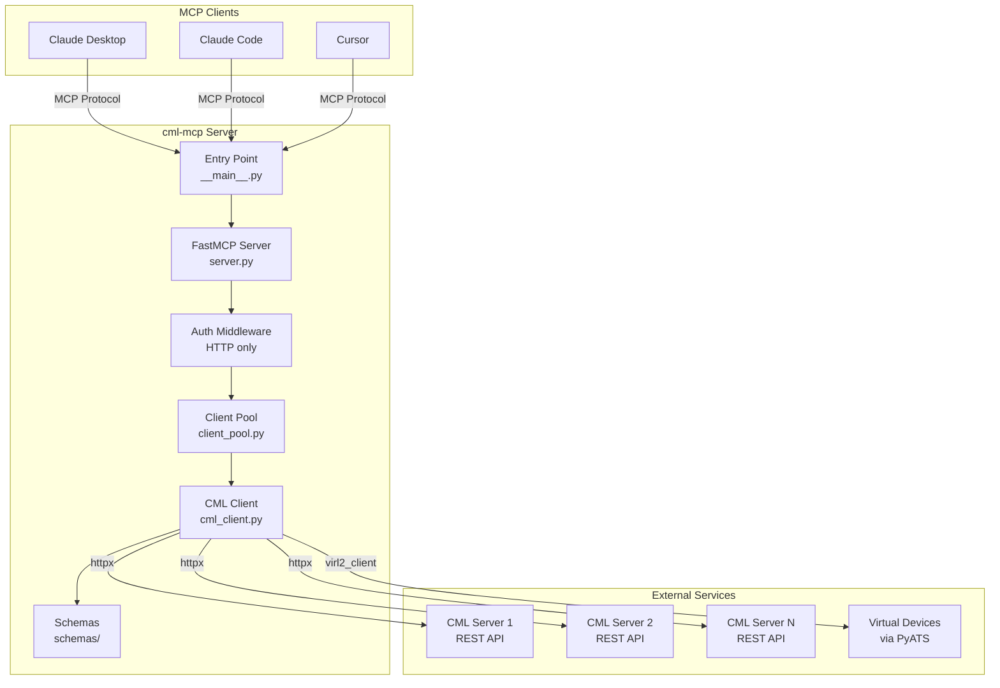
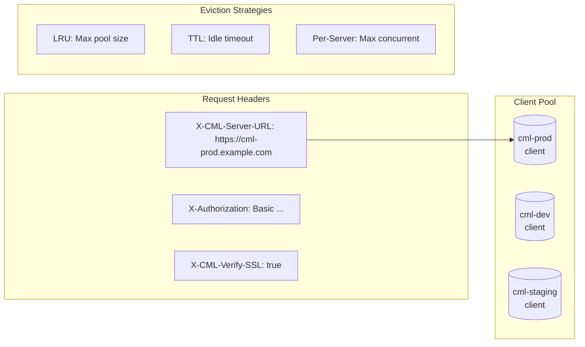
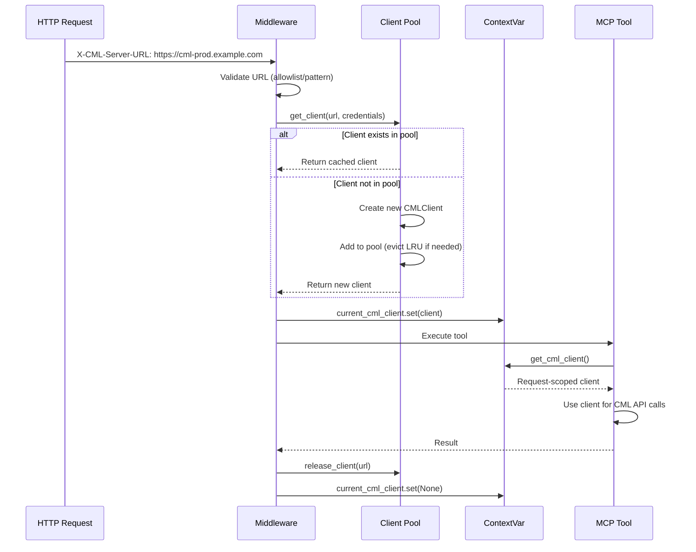
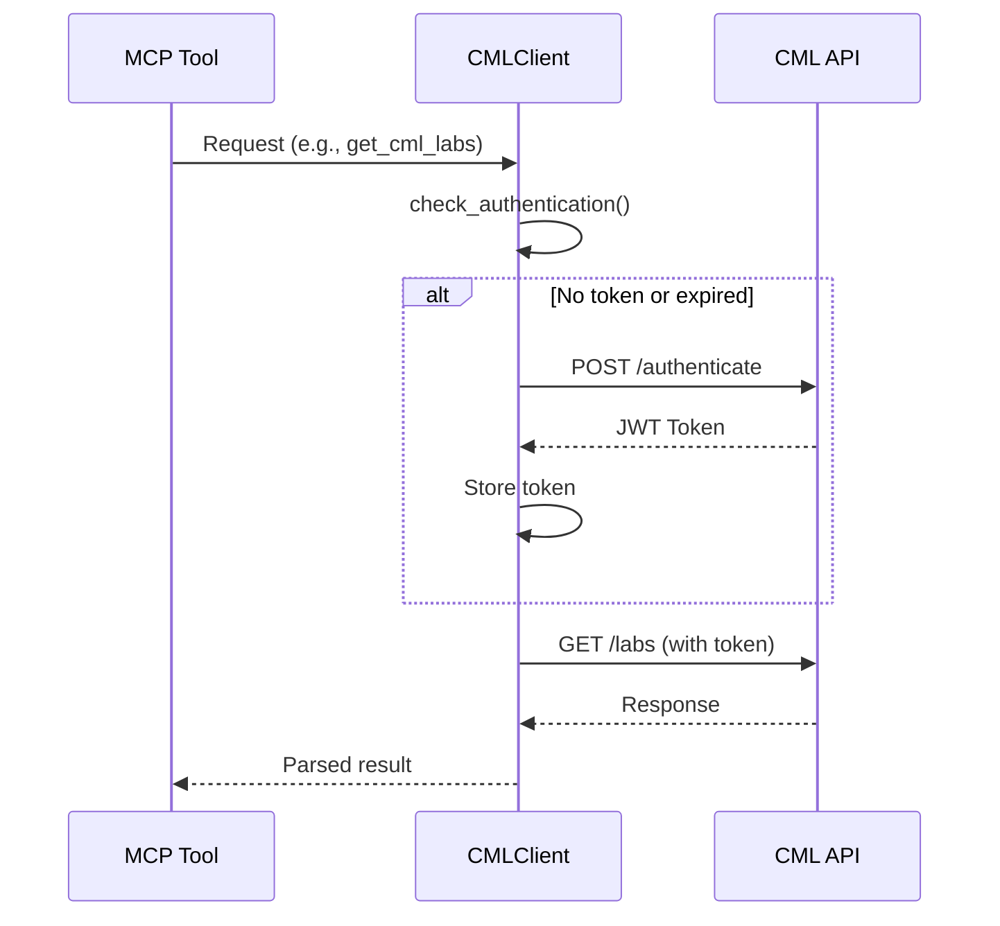
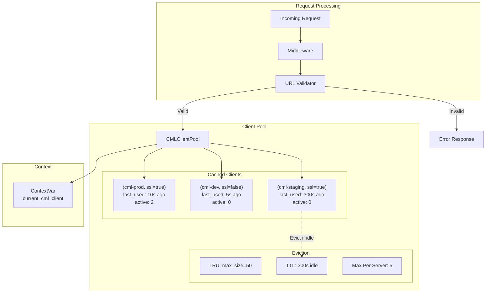
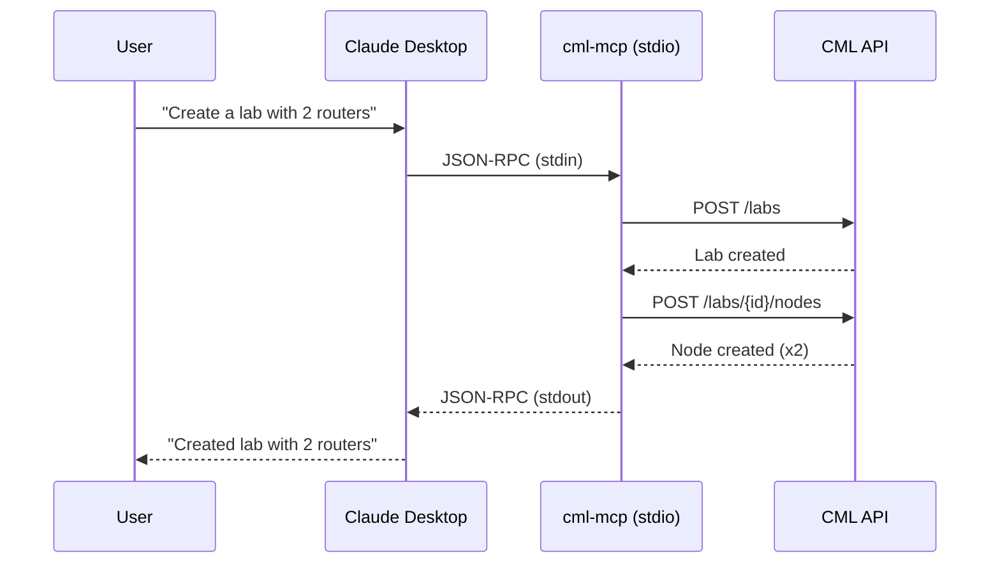
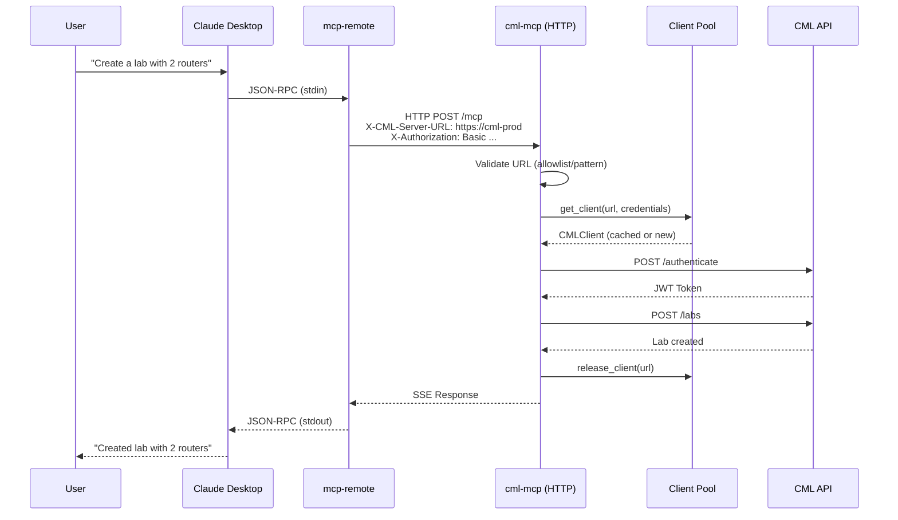
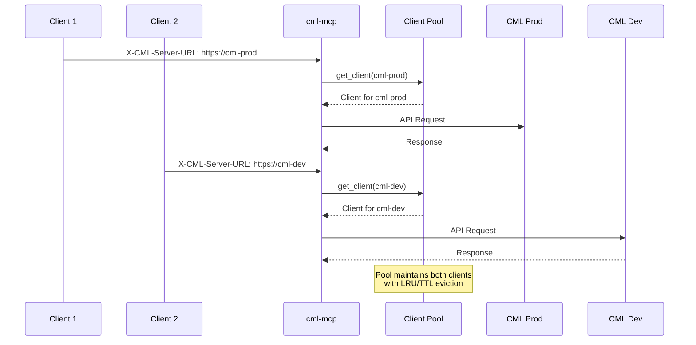
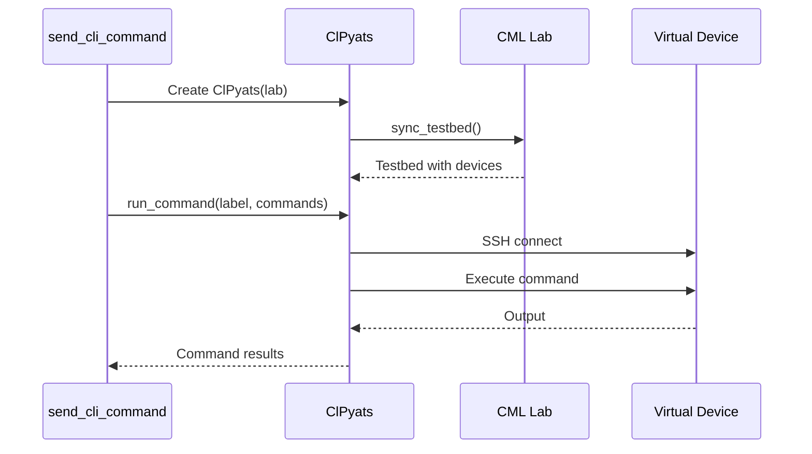
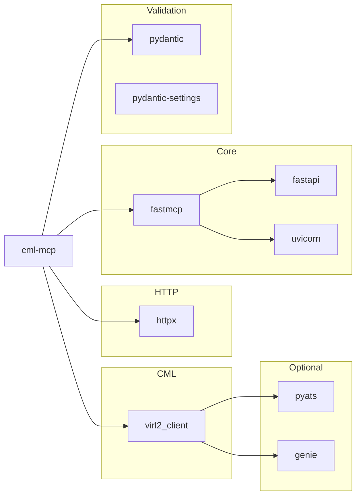

# Architecture

This document describes the architecture and design of the cml-mcp server for developers and contributors.

## System Overview



## Multi-Server Support (HTTP Mode)

In HTTP mode, cml-mcp supports connecting to **multiple CML servers** on a per-request basis. Each request can target a different CML server by specifying the server URL in the `X-CML-Server-URL` header.



### Request-Scoped Client Resolution



## Component Details

### Entry Point (`__main__.py`)

Determines transport mode and starts the appropriate server:

```python
def main():
    if settings.cml_mcp_transport == "stdio":
        asyncio.run(run())  # FastMCP async runner
    else:
        uvicorn.run(app, host=str(settings.cml_mcp_bind), port=settings.cml_mcp_port)
```

- **stdio mode**: Uses FastMCP's built-in async runner
- **HTTP mode**: Uses Uvicorn to serve the FastAPI application

### FastMCP Server (`server.py`)

The core module containing:

1. **Server initialization** with FastMCP 2.0
2. **39 MCP tool definitions** as decorated async functions
3. **Authentication middleware** for HTTP mode
4. **Client pool integration** for multi-server support (HTTP mode)

#### Server Initialization

```python
# Enable stateless mode for HTTP transport
if settings.cml_mcp_transport == "http":
    fastmcp_settings.stateless_http = True

# Create FastMCP server instance
server_mcp = FastMCP("Cisco Modeling Labs (CML)")

# Initialize client pool for HTTP mode
if settings.cml_mcp_transport == "http":
    cml_pool = CMLClientPool(
        max_size=settings.cml_pool_max_size,
        ttl_seconds=settings.cml_pool_ttl_seconds,
        max_per_server=settings.cml_pool_max_per_server,
        allowed_urls=[str(u) for u in settings.cml_allowed_urls],
        url_pattern=settings.cml_url_pattern,
    )
    server_mcp.add_middleware(CustomRequestMiddleware())
    app = server_mcp.http_app()
```

#### Tool Definition Pattern

All tools follow a consistent pattern using request-scoped client resolution:

```python
@server_mcp.tool(
    annotations={
        "title": "Human-readable title",
        "readOnlyHint": True,  # or False
        "destructiveHint": False,  # or True
        "idempotentHint": True,  # optional
    }
)
async def tool_name(param1: Type1, param2: Type2 = default) -> ReturnType:
    """
    Tool description for LLM understanding.
    """
    try:
        # Get the request-scoped client (HTTP) or global client (stdio)
        client = get_cml_client()
        result = await client.get("/endpoint")
        return ResultModel(**result)
    except httpx.HTTPStatusError as e:
        raise ToolError(f"HTTP error {e.response.status_code}: {e.response.text}")
    except Exception as e:
        logger.error(f"Error message: {str(e)}", exc_info=True)
        raise ToolError(e)
```

#### Destructive Operations

Tools that modify or delete data use MCP's elicit feature for confirmation:

```python
@server_mcp.tool(annotations={"destructiveHint": True})
async def delete_cml_lab(lid: UUID4Type, ctx: Context) -> bool:
    try:
        elicit_supported = True
        try:
            result = await ctx.elicit("Are you sure you want to delete?", response_type=None)
        except McpError as me:
            if me.error.code == METHOD_NOT_FOUND:
                elicit_supported = False
            else:
                raise me

        if not elicit_supported or result.action == "accept":
            # Perform destructive action
            await cml_client.delete(f"/labs/{lid}")
            return True
        else:
            raise Exception("Operation cancelled by user.")
    except Exception as e:
        raise ToolError(e)
```

### CML Client (`cml_client.py`)

Async HTTP client wrapping the CML REST API:

```python
class CMLClient:
    def __init__(
        self,
        host: str,
        username: str,
        password: str,
        transport: str = "stdio",
        verify_ssl: bool = False
    ):
        self.base_url = host.rstrip("/")
        self.api_base = f"{self.base_url}/api/v0"
        self.client = httpx.AsyncClient(verify=verify_ssl, timeout=API_TIMEOUT)
        self.vclient = virl2_client.ClientLibrary(...)  # For PyATS
```

### Client Pool (`client_pool.py`) - HTTP Mode Only

Manages a pool of `CMLClient` instances for multi-server support:

```python
class CMLClientPool:
    """
    Thread-safe pool of CMLClient instances with:
    - LRU eviction when at max capacity
    - TTL-based eviction for idle clients
    - Max concurrent connections per server
    - URL validation (allowlist + pattern)
    """

    def __init__(
        self,
        max_size: int = 50,
        ttl_seconds: int = 300,
        max_per_server: int = 5,
        allowed_urls: list[str] | None = None,
        url_pattern: str | None = None,
    ): ...

    async def get_client(self, url: str, username: str, password: str, verify_ssl: bool) -> CMLClient: ...
    async def release_client(self, url: str, verify_ssl: bool) -> None: ...
```

#### Request-Scoped Context

Uses Python's `contextvars` to provide request-scoped client access:

```python
from contextvars import ContextVar

# Set by middleware, accessed by tools
current_cml_client: ContextVar[CMLClient | None] = ContextVar("current_cml_client", default=None)

def get_cml_client() -> CMLClient:
    """Get the CML client for the current request (HTTP) or global client (stdio)."""
    client = current_cml_client.get()
    if client is None:
        return global_cml_client  # Fallback for stdio mode
    return client
```

#### HTTP Methods

| Method | Description |
|--------|-------------|
| `get(endpoint, params)` | HTTP GET request |
| `post(endpoint, data, params)` | HTTP POST request |
| `put(endpoint, data)` | HTTP PUT request |
| `patch(endpoint, data)` | HTTP PATCH request |
| `delete(endpoint)` | HTTP DELETE request |

#### Authentication Flow



### Settings (`settings.py`)

Pydantic-based configuration:

```python
class Settings(BaseSettings):
    model_config = SettingsConfigDict(
        env_file=".env",
        env_file_encoding="utf-8",
        extra="ignore",
        env_prefix="",
    )

    # Core CML settings
    cml_url: AnyHttpUrl | None = Field(default=None)
    cml_username: str | None = Field(default=None)
    cml_password: str | None = Field(default=None)
    cml_verify_ssl: bool = Field(default=False)

    # Transport settings
    cml_mcp_transport: TransportEnum = Field(default=TransportEnum.STDIO)
    cml_mcp_bind: IPvAnyAddress = Field(default_factory=lambda: IPv4Address("0.0.0.0"))
    cml_mcp_port: int = Field(default=9000)

    # Multi-server security (HTTP mode)
    cml_allowed_urls: list[AnyHttpUrl] = Field(default_factory=list)
    cml_url_pattern: str | None = Field(default=None)

    # Client pool settings (HTTP mode)
    cml_pool_max_size: int = Field(default=50)
    cml_pool_ttl_seconds: int = Field(default=300)
    cml_pool_max_per_server: int = Field(default=5)

    debug: bool = Field(default=False)
```

### Schemas (`schemas/`)

Pydantic models for CML API request/response validation:

```
schemas/
├── common.py              # UUID4Type, UserName, DefinitionID, etc.
├── labs.py                # Lab, LabCreate, LabTopology
├── nodes.py               # Node, NodeCreate, NodeTopology
├── links.py               # Link, LinkCreate, LinkConditionConfiguration
├── interfaces.py          # InterfaceCreate, InterfaceResponse
├── topologies.py          # Topology (for full lab import)
├── annotations.py         # TextAnnotation, RectangleAnnotation, etc.
├── users.py               # UserCreate, UserResponse
├── groups.py              # GroupCreate, GroupInfoResponse
├── system.py              # SystemInformation, SystemHealth, SystemStats
└── simple_core/           # State enums and type hints
```

## Client Pool Architecture (HTTP Mode)

The client pool manages connections to multiple CML servers with intelligent caching and eviction:



### Pool Eviction Strategies

| Strategy | Trigger | Behavior |
|----------|---------|----------|
| **LRU** | Pool at `max_size` | Evict least recently used client with no active requests |
| **TTL** | Client idle > `ttl_seconds` | Evict idle clients on next pool access |
| **Per-Server** | Server at `max_per_server` | Reject request with error (prevent connection exhaustion) |

### URL Validation

Incoming `X-CML-Server-URL` headers are validated against:

1. **Allowlist** (`CML_ALLOWED_URLS`): Explicit list of permitted URLs
2. **Pattern** (`CML_URL_PATTERN`): Regex pattern for permitted URLs

Both can be used together (AND logic) or independently.

## Data Flow

### stdio Mode



### HTTP Mode



### Multi-Server Request Flow (HTTP Mode)



## Error Handling

All tools use consistent error handling:

```python
try:
    # Tool implementation
    result = await cml_client.get("/endpoint")
    return result
except httpx.HTTPStatusError as e:
    # HTTP errors from CML API
    raise ToolError(f"HTTP error {e.response.status_code}: {e.response.text}")
except Exception as e:
    # Log for debugging
    logger.error(f"Error message: {str(e)}", exc_info=True)
    # Raise as ToolError for MCP protocol
    raise ToolError(e)
```

## PyATS Integration

For CLI command execution on running devices:



The integration uses:

- **virl2_client**: CML SDK for lab access
- **PyATS/Genie**: Cisco test automation framework
- **ClPyats**: Bridge between CML and PyATS

## Dependencies



## Extension Points

### Adding a New Tool

1. Define the tool function in `server.py`:

```python
@server_mcp.tool(
    annotations={
        "title": "My New Tool",
        "readOnlyHint": True,
    }
)
async def my_new_tool(param: str) -> dict:
    """Tool description."""
    # Use get_cml_client() for request-scoped client resolution
    client = get_cml_client()
    result = await client.get(f"/my-endpoint/{param}")
    return result
```

2. Add any required schemas to `schemas/`

3. Update documentation

### Adding a New Schema

1. Create or update schema file in `schemas/`
2. Import in `schemas/__init__.py`
3. Use in tool definitions

## Security Considerations

### URL Validation (HTTP Mode)

To prevent arbitrary CML server connections, configure URL restrictions:

```bash
# Option 1: Explicit allowlist
CML_ALLOWED_URLS='["https://cml-prod.example.com", "https://cml-dev.example.com"]'

# Option 2: Pattern matching
CML_URL_PATTERN='^https://cml-.*\.example\.com$'

# Option 3: Both (URL must match allowlist AND pattern)
CML_ALLOWED_URLS='["https://cml-prod.example.com"]'
CML_URL_PATTERN='^https://.*\.example\.com$'
```

### Connection Limits

Prevent resource exhaustion with pool limits:

```bash
CML_POOL_MAX_SIZE=50          # Max total clients in pool
CML_POOL_TTL_SECONDS=300      # Evict idle clients after 5 minutes
CML_POOL_MAX_PER_SERVER=5     # Max concurrent requests per CML server
```
