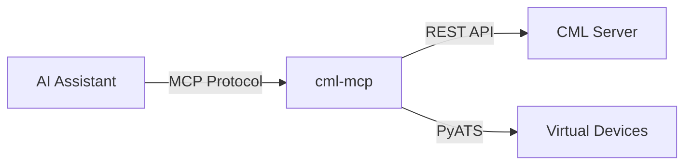

# CML-MCP Documentation

Welcome to the **cml-mcp** documentation. This guide provides comprehensive information for both **CML users** who want to interact with Cisco Modeling Labs through AI assistants, and **developers** who want to understand, extend, or contribute to the project.

## What is CML-MCP?

**cml-mcp** is a [Model Context Protocol (MCP)](https://modelcontextprotocol.io/) server for [Cisco Modeling Labs (CML)](https://www.cisco.com/c/en/us/products/cloud-systems-management/modeling-labs/index.html). It enables AI-powered applications like Claude Desktop, Claude Code, and Cursor to interact with CML through natural language commands.



### Key Capabilities

| Category | Features |
|----------|----------|
| **Lab Management** | Create, start, stop, wipe, delete labs |
| **Node Operations** | Add, configure, start, stop, delete nodes |
| **Link Management** | Connect nodes, apply link conditioning |
| **User/Group Admin** | Create and manage users and groups |
| **CLI Execution** | Run commands on virtual devices via PyATS |
| **Annotations** | Add visual annotations to lab topologies |

## Quick Start

### For CML Users

Install and configure with your favorite MCP client:

=== "Claude Desktop (uvx)"

    ```json
    {
      "mcpServers": {
        "Cisco Modeling Labs": {
          "command": "uvx",
          "args": ["cml-mcp"],
          "env": {
            "CML_URL": "https://your-cml-server.example.com",
            "CML_USERNAME": "admin",
            "CML_PASSWORD": "your_password"
          }
        }
      }
    }
    ```

=== "Claude Desktop (Docker)"

    ```json
    {
      "mcpServers": {
        "Cisco Modeling Labs": {
          "command": "docker",
          "args": [
            "run", "-i", "--rm",
            "-e", "CML_URL",
            "-e", "CML_USERNAME", 
            "-e", "CML_PASSWORD",
            "xorrkaz/cml-mcp:latest"
          ],
          "env": {
            "CML_URL": "https://your-cml-server.example.com",
            "CML_USERNAME": "admin",
            "CML_PASSWORD": "your_password"
          }
        }
      }
    }
    ```

=== "With PyATS (CLI Commands)"

    ```json
    {
      "mcpServers": {
        "Cisco Modeling Labs": {
          "command": "uvx",
          "args": ["cml-mcp[pyats]"],
          "env": {
            "CML_URL": "https://your-cml-server.example.com",
            "CML_USERNAME": "admin",
            "CML_PASSWORD": "your_password",
            "PYATS_USERNAME": "cisco",
            "PYATS_PASSWORD": "cisco",
            "PYATS_AUTH_PASS": "cisco"
          }
        }
      }
    }
    ```

### For Developers

```bash
# Clone and install
git clone https://github.com/xorrkaz/cml-mcp.git
cd cml-mcp
uv sync --all-extras

# Configure
cp .env.example .env
# Edit .env with your CML credentials

# Run
cml-mcp
```

## Documentation Structure

| Section | Audience | Description |
|---------|----------|-------------|
| [User Guide](user-guide.md) | CML Users | How to use cml-mcp with AI assistants |
| [API Reference](api-reference.md) | All | Complete tool reference with parameters |
| [Configuration](configuration.md) | All | Environment variables and settings |
| [Transport Modes](transport-modes.md) | All | stdio vs HTTP transport explained |
| [Architecture](architecture.md) | Developers | System design and components |
| [Schemas](schemas.md) | Developers | Pydantic data models |
| [Development](development.md) | Contributors | Setup, testing, and contributing |
| [Docker](docker.md) | All | Container deployment options |

## Technology Stack

| Component | Technology | Purpose |
|-----------|------------|---------|
| MCP Framework | [FastMCP 2.0](https://gofastmcp.com/) | MCP server implementation |
| HTTP Server | [Uvicorn](https://www.uvicorn.org/) + [FastAPI](https://fastapi.tiangolo.com/) | HTTP transport |
| HTTP Client | [httpx](https://www.python-httpx.org/) | Async CML API calls |
| CML SDK | [virl2_client](https://github.com/CiscoDevNet/virl2-client) | PyATS integration |
| Data Validation | [Pydantic](https://docs.pydantic.dev/) | Request/response schemas |
| CLI Commands | [PyATS](https://developer.cisco.com/pyats/) | Device CLI execution |

## Requirements

- **Python 3.12+**
- **CML 2.9+** server with API access
- **MCP-compatible client** (Claude Desktop, Cursor, etc.)

## License

The MCP server code is licensed under the [BSD 2-Clause License](https://github.com/xorrkaz/cml-mcp/blob/main/LICENSE). The Pydantic schemas in `src/cml_mcp/schemas/` are covered under a [proprietary Cisco license](https://github.com/xorrkaz/cml-mcp/blob/main/src/cml_mcp/schemas/LICENSE).

## Support

- **Issues**: [GitHub Issues](https://github.com/xorrkaz/cml-mcp/issues)
- **Discussions**: [GitHub Discussions](https://github.com/xorrkaz/cml-mcp/discussions)
