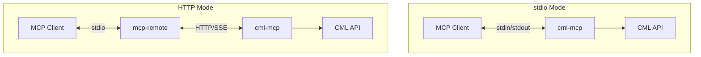

# Transport Modes

cml-mcp supports two transport modes for communication with MCP clients: **stdio** and **HTTP**.

## Overview

| Feature | stdio Mode | HTTP Mode |
|---------|------------|-----------|
| Communication | stdin/stdout pipes | HTTP + Server-Sent Events |
| Authentication | Environment variables | HTTP headers (per-request) |
| Token caching | ✅ Yes | ❌ No (stateless) |
| Multi-client | ❌ No | ✅ Yes |
| Remote access | ❌ No | ✅ Yes |
| Complexity | Low | Medium |



## stdio Mode (Default)

The standard MCP transport where the server reads JSON-RPC requests from stdin and writes responses to stdout.

### When to Use

- Direct integration with MCP clients (Claude Desktop, Cursor)
- Single-user, single-client scenarios
- Simplest setup and configuration
- Running locally on the same machine

### Configuration

```bash
# Environment variables
export CML_URL=https://cml.example.com
export CML_USERNAME=admin
export CML_PASSWORD=secret
# CML_MCP_TRANSPORT defaults to "stdio"

# Run
cml-mcp
```

### MCP Client Configuration

=== "uvx"

    ```json
    {
      "mcpServers": {
        "Cisco Modeling Labs": {
          "command": "uvx",
          "args": ["cml-mcp"],
          "env": {
            "CML_URL": "https://cml.example.com",
            "CML_USERNAME": "admin",
            "CML_PASSWORD": "secret"
          }
        }
      }
    }
    ```

=== "Docker"

    ```json
    {
      "mcpServers": {
        "Cisco Modeling Labs": {
          "command": "docker",
          "args": [
            "run", "-i", "--rm", "--pull", "always",
            "-e", "CML_URL",
            "-e", "CML_USERNAME",
            "-e", "CML_PASSWORD",
            "xorrkaz/cml-mcp:latest"
          ],
          "env": {
            "CML_URL": "https://cml.example.com",
            "CML_USERNAME": "admin",
            "CML_PASSWORD": "secret"
          }
        }
      }
    }
    ```

### How It Works

```
┌─────────────────┐     stdin      ┌─────────────────┐
│   MCP Client    │ ──────────────▶│   cml-mcp       │
│ (Claude Desktop)│                │   (stdio)       │
│                 │ ◀──────────────│                 │
└─────────────────┘     stdout     └─────────────────┘
```

1. Client spawns cml-mcp as a subprocess
2. Client sends JSON-RPC requests via stdin
3. Server authenticates once, caches JWT token
4. Server processes requests and calls CML API
5. Server writes JSON-RPC responses to stdout

---

## HTTP Mode

Runs as a standalone HTTP service using Server-Sent Events (SSE) for streaming.

### When to Use

- Multiple clients connecting to the same server
- Running on a remote machine or server
- Containerized/Kubernetes deployments
- Shared infrastructure scenarios
- Clients that don't support process spawning

### Configuration

```bash
# Server configuration
export CML_URL=https://cml.example.com
export CML_MCP_TRANSPORT=http
export CML_MCP_BIND=0.0.0.0
export CML_MCP_PORT=9000
# No username/password needed (provided via headers)

# Run
cml-mcp

# Or with uvicorn directly (for development)
uvicorn cml_mcp.server:app --host 0.0.0.0 --port 9000 --reload
```

### Authentication Headers

In HTTP mode, authentication is provided on each request:

| Header | Format | Purpose |
|--------|--------|---------|
| `X-Authorization` | `Basic <base64(user:pass)>` | CML credentials |
| `X-PyATS-Authorization` | `Basic <base64(user:pass)>` | Device credentials |
| `X-PyATS-Enable` | `Basic <base64(password)>` | Enable password |

### Encoding Credentials

```bash
# Linux/macOS
echo -n "admin:secret" | base64
# Output: YWRtaW46c2VjcmV0

# Windows PowerShell
[Convert]::ToBase64String([Text.Encoding]::UTF8.GetBytes("admin:secret"))
```

### MCP Client Configuration

MCP clients don't natively support HTTP. Use `mcp-remote` as a bridge:

=== "Basic"

    ```json
    {
      "mcpServers": {
        "Cisco Modeling Labs": {
          "command": "npx",
          "args": [
            "-y", "mcp-remote",
            "http://server-host:9000/mcp",
            "--header", "X-Authorization: Basic YWRtaW46c2VjcmV0"
          ]
        }
      }
    }
    ```

=== "With PyATS"

    ```json
    {
      "mcpServers": {
        "Cisco Modeling Labs": {
          "command": "npx",
          "args": [
            "-y", "mcp-remote",
            "http://server-host:9000/mcp",
            "--header", "X-Authorization: Basic YWRtaW46c2VjcmV0",
            "--header", "X-PyATS-Authorization: Basic Y2lzY286Y2lzY28=",
            "--header", "X-PyATS-Enable: Basic Y2lzY28="
          ]
        }
      }
    }
    ```

=== "Self-signed TLS"

    ```json
    {
      "mcpServers": {
        "Cisco Modeling Labs": {
          "command": "npx",
          "args": [
            "-y", "mcp-remote",
            "https://server-host:9000/mcp",
            "--header", "X-Authorization: Basic YWRtaW46c2VjcmV0"
          ],
          "env": {
            "NODE_TLS_REJECT_UNAUTHORIZED": "0"
          }
        }
      }
    }
    ```

### How It Works

```
┌─────────────────┐              ┌─────────────────┐              ┌─────────────────┐
│   MCP Client    │    stdio     │   mcp-remote    │   HTTP/SSE   │   cml-mcp       │
│ (Claude Desktop)│◀────────────▶│    (bridge)     │◀────────────▶│   (HTTP)        │
└─────────────────┘              └─────────────────┘              └─────────────────┘
```

1. Client spawns `mcp-remote` as a subprocess
2. `mcp-remote` connects to cml-mcp via HTTP
3. Each request includes authentication headers
4. Server authenticates with CML on each request (stateless)
5. Responses are streamed via Server-Sent Events

### Authentication Middleware

The HTTP mode uses custom middleware to handle authentication:

```python
class CustomRequestMiddleware(Middleware):
    async def on_request(self, context: MiddlewareContext, call_next) -> Any:
        # Reset client state (stateless)
        cml_client.token = None
        
        # Extract credentials from X-Authorization header
        headers = get_http_headers()
        auth_header = headers.get("x-authorization")
        
        # Decode and validate credentials
        decoded = base64.b64decode(parts[1]).decode("utf-8")
        username, password = decoded.split(":", 1)
        
        # Set credentials and authenticate
        cml_client.username = username
        cml_client.password = password
        await cml_client.check_authentication()
        
        # Process request
        return await call_next(context)
```

---

## Docker Deployments

### stdio Mode

```bash
docker run -i --rm \
  -e CML_URL=https://cml.example.com \
  -e CML_USERNAME=admin \
  -e CML_PASSWORD=secret \
  xorrkaz/cml-mcp:latest
```

### HTTP Mode

```bash
docker run -d \
  --name cml-mcp \
  -p 9000:9000 \
  -e CML_URL=https://cml.example.com \
  -e CML_MCP_TRANSPORT=http \
  xorrkaz/cml-mcp:latest
```

### Docker Compose

See [Docker](docker.md) for complete docker-compose configuration with multiple profiles.

---

## Choosing a Transport

| Scenario | Recommended |
|----------|-------------|
| Desktop usage with Claude Desktop/Cursor | stdio |
| Single user, local machine | stdio |
| Multiple users/clients | HTTP |
| Running on a server | HTTP |
| Kubernetes deployment | HTTP |
| CI/CD pipelines | Either |
| Maximum simplicity | stdio |
| Maximum flexibility | HTTP |
