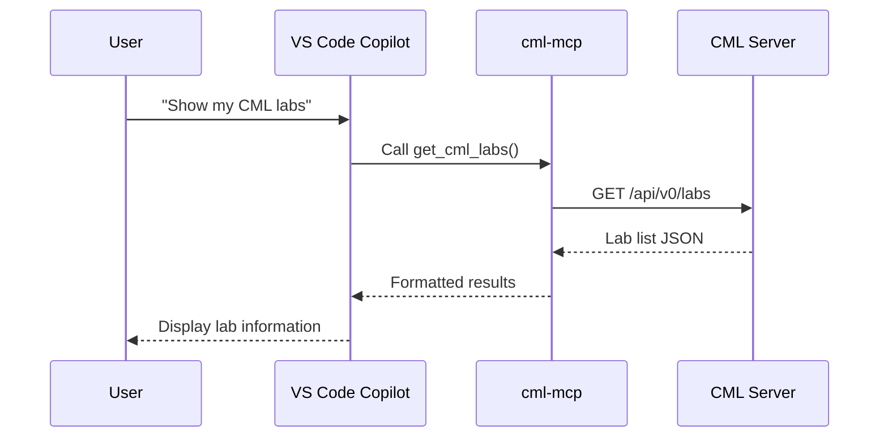

# User Guide

This guide helps CML users get started with cml-mcp and interact with Cisco Modeling Labs through AI assistants.

## Overview

cml-mcp enables natural language interaction with CML. Instead of using the web UI or writing scripts, you can ask your AI assistant to:

- "Create a new lab with two routers connected together"
- "Start the lab called 'My Network Test'"
- "Show me all nodes in the lab and their states"
- "Configure router1 with hostname R1 and enable SSH"
- "Run `show ip interface brief` on all routers"

## Installation Methods

### Method 1: uvx (Recommended)

The simplest way to use cml-mcp. No local installation required—`uvx` fetches the package from [PyPI](https://pypi.org/project/cml-mcp/) and runs it on-demand:

```json
{
  "mcpServers": {
    "Cisco Modeling Labs": {
      "command": "uvx",
      "args": ["cml-mcp"],
      "env": {
        "CML_URL": "https://cml.example.com",
        "CML_USERNAME": "admin",
        "CML_PASSWORD": "your_password"
      }
    }
  }
}
```

!!! info "How does this work without installation?"
    The `uvx` command (from [Astral's uv](https://docs.astral.sh/uv/)) automatically downloads `cml-mcp` from PyPI, caches it locally, and executes it. This is similar to `npx` for Node.js packages.

### Method 2: pip Install

Install globally or in a virtual environment:

```bash
pip install cml-mcp

# With PyATS support for CLI commands
pip install cml-mcp[pyats]
```

Then configure your MCP client:

```json
{
  "mcpServers": {
    "Cisco Modeling Labs": {
      "command": "cml-mcp",
      "env": {
        "CML_URL": "https://cml.example.com",
        "CML_USERNAME": "admin",
        "CML_PASSWORD": "your_password"
      }
    }
  }
}
```

### Method 3: Docker

Use the pre-built Docker image:

```json
{
  "mcpServers": {
    "Cisco Modeling Labs": {
      "command": "docker",
      "args": [
        "run", "-i", "--rm", "--pull", "always",
        "-e", "CML_URL",
        "-e", "CML_USERNAME",
        "-e", "CML_PASSWORD",
        "xorrkaz/cml-mcp:latest"
      ],
      "env": {
        "CML_URL": "https://cml.example.com",
        "CML_USERNAME": "admin",
        "CML_PASSWORD": "your_password"
      }
    }
  }
}
```

## Client Configuration

### Claude Desktop

Add the configuration to your Claude Desktop config file:

=== "macOS"

    ```bash
    # Edit the config file
    code ~/Library/Application\ Support/Claude/claude_desktop_config.json
    ```

=== "Windows"

    ```powershell
    # Edit the config file
    code $env:APPDATA\Claude\claude_desktop_config.json
    ```

=== "Linux"

    ```bash
    # Edit the config file
    code ~/.config/Claude/claude_desktop_config.json
    ```

Example configuration:

```json
{
  "mcpServers": {
    "Cisco Modeling Labs": {
      "command": "uvx",
      "args": ["cml-mcp"],
      "env": {
        "CML_URL": "https://cml.example.com",
        "CML_USERNAME": "admin",
        "CML_PASSWORD": "your_password"
      }
    }
  }
}
```

After saving, restart Claude Desktop. You should see the CML tools available in the tools menu (🔧).

### VS Code with GitHub Copilot

VS Code supports MCP servers through GitHub Copilot Chat. Configure the server in your VS Code settings:

#### Option 1: User Settings (Global)

1. Open VS Code Settings (`Cmd+,` on macOS, `Ctrl+,` on Windows/Linux)
2. Search for `mcp`
3. Click "Edit in settings.json"
4. Add the MCP server configuration:

```json
{
  "mcp": {
    "servers": {
      "cml-mcp": {
        "command": "uvx",
        "args": ["cml-mcp"],
        "env": {
          "CML_URL": "https://cml.example.com",
          "CML_USERNAME": "admin",
          "CML_PASSWORD": "your_password"
        }
      }
    }
  }
}
```

#### Option 2: Workspace Settings (Project-Specific)

Create a `.vscode/mcp.json` file in your workspace:

```json
{
  "servers": {
    "cml-mcp": {
      "command": "uvx",
      "args": ["cml-mcp"],
      "env": {
        "CML_URL": "https://cml.example.com",
        "CML_USERNAME": "admin",
        "CML_PASSWORD": "your_password"
      }
    }
  }
}
```

!!! tip "Environment Variables"
    For security, you can reference environment variables instead of hardcoding credentials:

    ```json
    {
      "servers": {
        "cml-mcp": {
          "command": "uvx",
          "args": ["cml-mcp"],
          "env": {
            "CML_URL": "${env:CML_URL}",
            "CML_USERNAME": "${env:CML_USERNAME}",
            "CML_PASSWORD": "${env:CML_PASSWORD}"
          }
        }
      }
    }
    ```

#### Using CML Tools in VS Code

1. Open GitHub Copilot Chat (`Cmd+Shift+I` or `Ctrl+Shift+I`)
2. Switch to **Agent Mode** (click the dropdown next to the chat input)
3. The CML tools will be available automatically
4. Ask questions like: *"List all my CML labs"* or *"Create a new lab with two routers"*



### Other MCP Clients

Any MCP-compatible client can use cml-mcp. The general configuration pattern is:

1. **Command**: `uvx` (or `python -m cml_mcp` if installed via pip)
2. **Args**: `["cml-mcp"]` (for uvx) or `[]` (for direct execution)
3. **Environment**: Set `CML_URL`, `CML_USERNAME`, `CML_PASSWORD`

## Configuration

### Required Settings

| Variable | Description | Example |
|----------|-------------|---------|
| `CML_URL` | CML server URL | `https://cml.example.com` |
| `CML_USERNAME` | CML username | `admin` |
| `CML_PASSWORD` | CML password | `your_password` |

### Optional Settings

| Variable | Default | Description |
|----------|---------|-------------|
| `CML_VERIFY_SSL` | `false` | Verify SSL certificates |
| `DEBUG` | `false` | Enable debug logging |

### PyATS Settings (for CLI Commands)

To run CLI commands on booted devices, you need PyATS credentials:

| Variable | Description | Example |
|----------|-------------|---------|
| `PYATS_USERNAME` | Device login username | `cisco` |
| `PYATS_PASSWORD` | Device login password | `cisco` |
| `PYATS_AUTH_PASS` | Device enable password | `cisco` |

## Available Tools

cml-mcp exposes **39 tools** organized into categories:

### System Information

| Tool | Description |
|------|-------------|
| `get_cml_information` | Get CML server version and build info |
| `get_cml_status` | Get server health status |
| `get_cml_statistics` | Get usage statistics |
| `get_cml_licensing_details` | Get license information |

### Lab Management

| Tool | Description |
|------|-------------|
| `get_cml_labs` | List all labs (optionally filter by user) |
| `get_cml_lab_by_title` | Find a lab by its title |
| `create_empty_lab` | Create a new empty lab |
| `create_full_lab_topology` | Create a complete lab with nodes and links |
| `modify_cml_lab` | Update lab properties |
| `start_cml_lab` | Start all nodes in a lab |
| `stop_cml_lab` | Stop all nodes in a lab |
| `wipe_cml_lab` | Wipe all node data (requires confirmation) |
| `delete_cml_lab` | Delete a lab (requires confirmation) |

### Node Operations

| Tool | Description |
|------|-------------|
| `get_cml_node_definitions` | List available node types |
| `get_node_definition_detail` | Get details about a node type |
| `get_nodes_for_cml_lab` | List all nodes in a lab |
| `add_node_to_cml_lab` | Add a new node |
| `configure_cml_node` | Set node configuration (for new/wiped nodes) |
| `start_cml_node` | Start a specific node |
| `stop_cml_node` | Stop a specific node |
| `wipe_cml_node` | Wipe node data (requires confirmation) |
| `delete_cml_node` | Delete a node (requires confirmation) |
| `get_console_log` | Get console output from a running node |
| `send_cli_command` | Execute CLI commands on a running node |

### Interface & Link Operations

| Tool | Description |
|------|-------------|
| `get_interfaces_for_node` | List interfaces on a node |
| `add_interface_to_node` | Add an interface to a node |
| `connect_two_nodes` | Create a link between two interfaces |
| `get_all_links_for_lab` | List all links in a lab |
| `start_cml_link` | Enable a link |
| `stop_cml_link` | Disable a link |
| `apply_link_conditioning` | Add latency, loss, bandwidth limits |

### Annotations

| Tool | Description |
|------|-------------|
| `add_annotation_to_cml_lab` | Add text, rectangle, ellipse, or line |
| `delete_annotation_from_lab` | Remove an annotation |

### User & Group Management (Admin Only)

| Tool | Description |
|------|-------------|
| `get_cml_users` | List all users |
| `create_cml_user` | Create a new user |
| `delete_cml_user` | Delete a user |
| `get_cml_groups` | List all groups |
| `create_cml_group` | Create a new group |
| `delete_cml_group` | Delete a group |

## Common Workflows

### Create and Start a Simple Lab

Ask your AI assistant:

> "Create a new lab called 'Test Network' with two IOSv routers connected together, then start it"

The assistant will:

1. Create an empty lab with title "Test Network"
2. Add two nodes using the `iosv` definition
3. Create a link between them
4. Start the lab

### Configure Devices

For new or wiped nodes (before starting):

> "Set the configuration for router1 to include hostname R1, enable SSH, and configure interface GigabitEthernet0/0 with IP 10.0.0.1/24"

For running nodes (requires PyATS):

> "Run 'show running-config' on router1"

### Apply Link Conditioning

> "Add 100ms latency and 5% packet loss to the link between router1 and router2"

### Troubleshoot a Device

> "Show me the console log for router1 to see the boot messages"

## Tips for Best Results

1. **Be specific about lab names**: Use exact lab titles when possible
2. **Use node labels**: Reference nodes by their label, not UUID
3. **Wait for convergence**: Ask the assistant to wait for nodes to boot before running commands
4. **Check prerequisites**: Ensure nodes are in the correct state (e.g., BOOTED for CLI commands)

## Troubleshooting

### "CML_URL must be set"

Ensure your MCP client configuration includes all required environment variables.

### "Unauthorized" errors

Verify your CML credentials are correct and the user has appropriate permissions.

### CLI commands fail

1. Ensure the node is in BOOTED state
2. Install PyATS: `pip install cml-mcp[pyats]`
3. Configure PYATS_* environment variables

### Self-signed certificate errors

Set `CML_VERIFY_SSL=false` in your environment.
